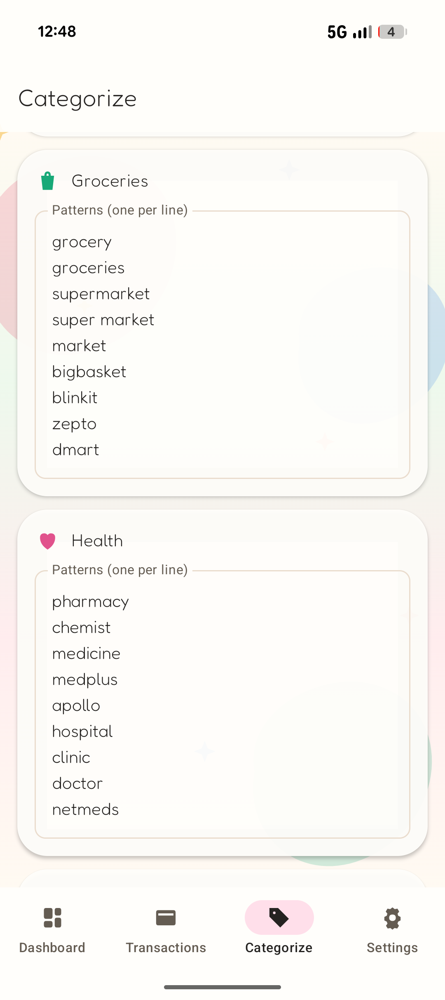
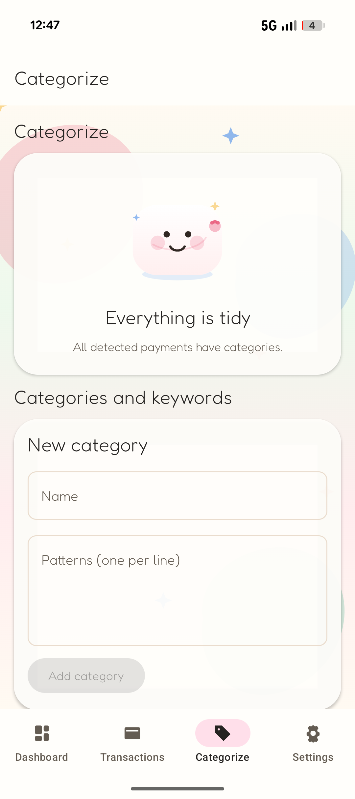

# 🍡 Mochi Money

A kawaii, offline, open-source Android app that turns the payment SMS already on your
phone into a spending dashboard.

<p align="center">
  
  
  
</p>

## Install

Download the latest signed APK from the
[Releases page](https://github.com/gnshb/mochi-money/releases).

## Build from source

Requirements: JDK 17, Android SDK with platform 35 and build-tools.

```sh
git clone https://github.com/gnshb/mochi-money.git
cd mochi-money
./gradlew :app:assembleDebug          # debug APK
./gradlew :app:testDebugUnitTest      # unit tests (parser regressions)
./gradlew :app:assembleRelease        # minified release APK (~2 MB)
```

## License

GPL v3. See [LICENSE](LICENSE).
