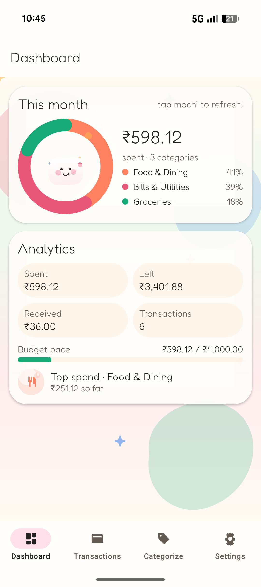
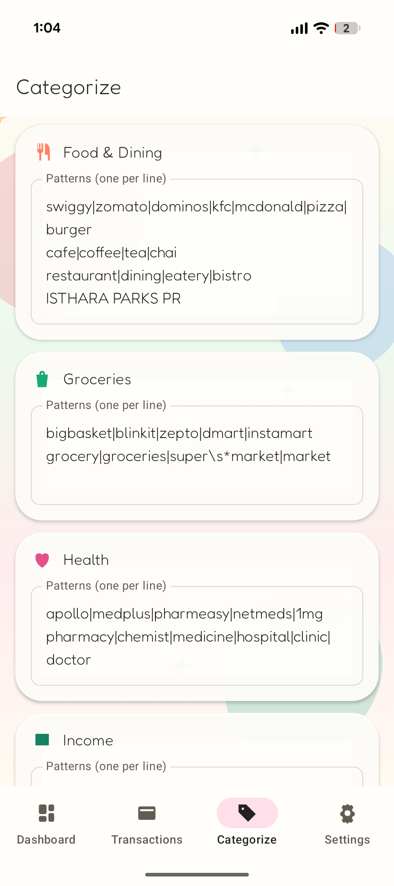
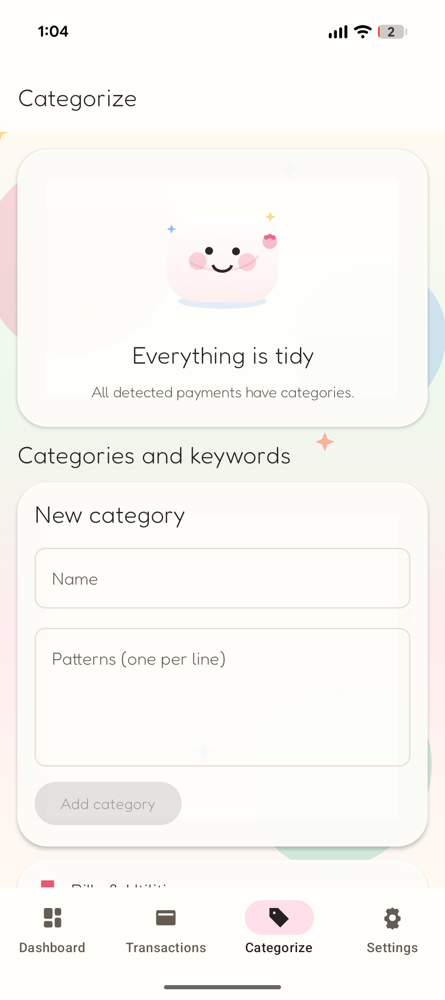

# 🍡 Mochi Money

A kawaii, offline, open-source Android app that turns the payment SMS already on your
phone into a spending dashboard.

<p align="center">
  
  
  
</p>

## Install

Download the latest signed APK from the
[Releases page](https://github.com/gnshb/mochi-money/releases).

## Build from source

Requirements: JDK 17, Android SDK with platform 35 and build-tools.

```sh
git clone https://github.com/gnshb/mochi-money.git
cd mochi-money
./gradlew :app:assembleDebug          # debug APK
./gradlew :app:testDebugUnitTest      # unit tests (parser regressions)
./gradlew :app:assembleRelease        # minified release APK (~2 MB)
```

## Changelog

### v0.2.4

- Improved SMS parsing for broader UPI, linked-account, credit-card, merchant, and payer formats.
- Repaired stale SMS imports when parser improvements identify a better direction, counterparty, or category.

### v0.2.3

- Fixed counterparty parsing for ICICI-style credited merchant SMS and TMB linked-account/credit-card UPI messages.

### v0.2.2

- Updated Splitwise dashboard wording from Spend/Received to You owe/Owed.

### v0.2.1

- Fixed category keyword edits so removing a pattern re-evaluates existing transactions and unmatches stale classifications.

### v0.2.0

- Added Splitwise support with group selection and imported owed/owing expenses.
- Improved the dashboard analytics with category net totals sorted by spend and a brief scan-status popup.

### v0.1.0

- Initial release.

## License

GPL v3. See [LICENSE](LICENSE).
